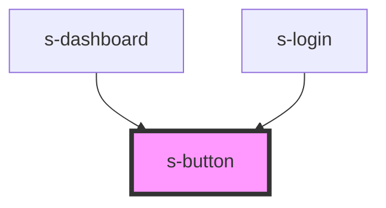

# s-button

<!-- Auto Generated Below -->

## Properties

| Property    | Attribute    | Description | Type                              | Default     |
| ----------- | ------------ | ----------- | --------------------------------- | ----------- |
| `ariaLabel` | `aria-label` |             | `string`                          | `undefined` |
| `disabled`  | `disabled`   |             | `boolean`                         | `false`     |
| `size`      | `size`       |             | `"large" \| "small"`              | `'large'`   |
| `type`      | `type`       |             | `"button" \| "reset" \| "submit"` | `undefined` |
| `variant`   | `variant`    |             | `string`                          | `'primary'` |

## Dependencies

### Used by

 - [s-dashboard](../s-dashboard)
 - [s-login](../s-login)

### Graph

----------------------------------------------

*Built with [StencilJS](https://stenciljs.com/)*
