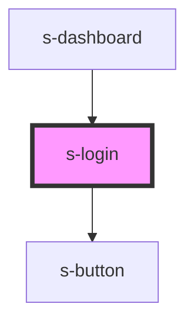

# s-login

<!-- Auto Generated Below -->

## Events

| Event           | Description | Type                   |
| --------------- | ----------- | ---------------------- |
| `joinCompleted` |             | `CustomEvent<boolean>` |

## Dependencies

### Used by

 - [s-dashboard](../s-dashboard)

### Depends on

- [s-button](../s-button)

### Graph

----------------------------------------------

*Built with [StencilJS](https://stenciljs.com/)*
