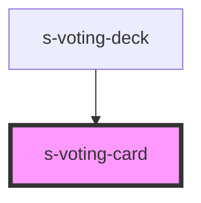

# s-voting-card

<!-- Auto Generated Below -->

## Properties

| Property  | Attribute | Description | Type      | Default     |
| --------- | --------- | ----------- | --------- | ----------- |
| `checked` | `checked` |             | `boolean` | `false`     |
| `value`   | `value`   |             | `string`  | `undefined` |

## Dependencies

### Used by

 - [s-voting-deck](../s-voting-deck)

### Graph

----------------------------------------------

*Built with [StencilJS](https://stenciljs.com/)*
